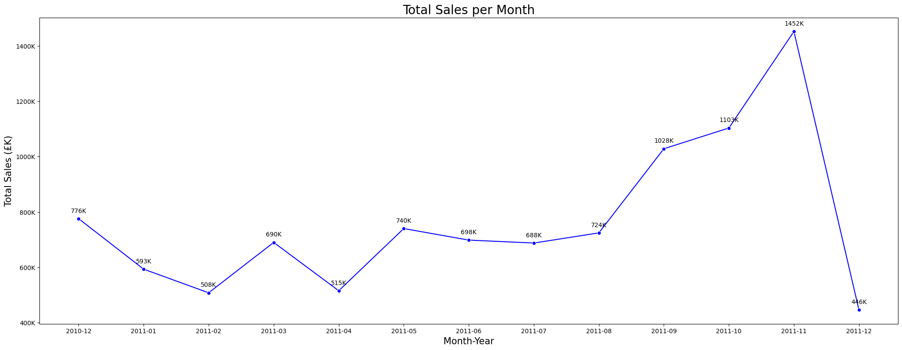

## Sales Trends Over Time

## Interpretation
The line graph illustrates the total sales (£K) per month from December 2010 to December 2011. Key observations:

- Sales declined from December 2010 to early 2011.
- There was a fluctuating trend throughout 2011, with notable peaks in March, May, and September.
- Sales peaked in November 2011 at £1,452K before a sharp drop in December 2011 to £416K.

This trend suggests a potential seasonality effect, with a strong increase before the holiday season and a significant drop afterward.

## Visualization

